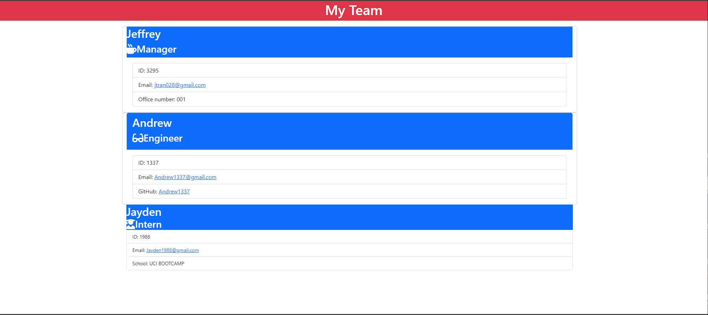

# MANAGER-TEAM-GEN-TOOL

## Description
Your challenge is to build a Node.js command-line application that takes in information about employees on a software engineering team and generates an HTML webpage that displays summaries for each person.

Because this Challenge will require the use of the Inquirer package, ensure that you install and use Inquirer version 8.2.4. To do so, use the following command in your project folder: npm i inquirer@8.2.4.

Testing is key to making code maintainable, you’ll also write unit tests for each part of your code and ensure that it passes all of them.

## Installation
In order to install inquirer, please use npm i inquirer@8.2.4.

## Credits
  *  (https://cloudconvert.com/) - used to convert WEBM file to MP4 for submission
  * 
## Screenshots 

## Reach Me @:
* Github: Jtran028 LINK: (https://github.com/Jtran028)
* Email: jtran028@gmail.com